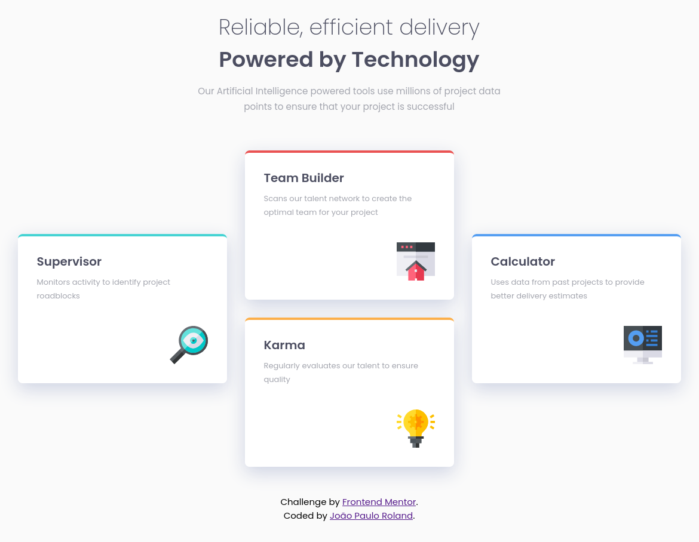

# Frontend Mentor - Four card feature section solution

This is a solution to the [Four card feature section challenge on Frontend Mentor](https://www.frontendmentor.io/challenges/four-card-feature-section-weK1eFYK). Frontend Mentor challenges help you improve your coding skills by building realistic projects. 

## Table of contents

- [Overview](#overview)
  - [The challenge](#the-challenge)
  - [Screenshot](#screenshot)
  - [Links](#links)
- [My process](#my-process)
  - [Built with](#built-with)
  - [What I learned](#what-i-learned)
  - [Continued development](#continued-development)
- [Author](#author)
- [Acknowledgments](#acknowledgments)

## Overview

### The challenge

Users should be able to:

- View the optimal layout for the site depending on their device's screen size

### Screenshot

### Links

- Solution URL: https://github.com/jp-roland/four-card-feature-section
- Live Site URL: https://four-card-feature-section-nu-eight.vercel.app/

## My process

### Built with

- Flexbox
- CSS Grid
- Mobile-first workflow

### What I learned

- After struggling with Flexbox I found out that CSS Grid was way easier to use.
- It is best to keep margins and padding simple.
- To never chase pixel-perfection.

### Continued development

I want to continue getting comfortable with CSS and HTML until I can progress to more advanced aspects of front-end development.

## Author

- Frontend Mentor - [@jp-roland](https://www.frontendmentor.io/profile/jp-roland)

## Acknowledgments

I want to thank the valuable feedback I received from the Frontend Mentor community for my [previous challenge](https://github.com/jp-roland/single-price-grid-component).